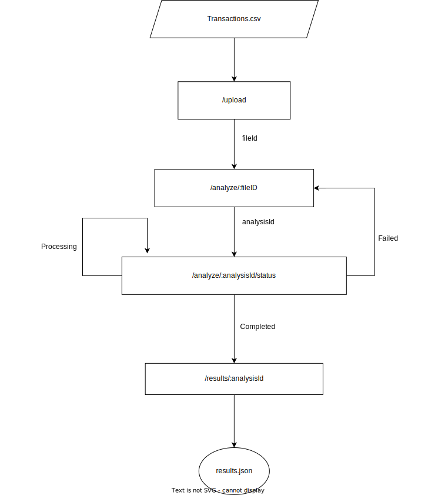

LLM Powered API for Fraud Detection.



API Endpoints:
1. Upload Transactions\
Endpoint: POST /upload\
Description: This endpoint is used to upload a CSV file containing transaction data.\
Request: The request should be a multipart/form-data containing the file to be uploaded.\
Response: On successful upload, returns a file_id.


2. Analyze Transactions\
Endpoint: POST /analyze/:fileID\
Description: Initiates the analysis of the uploaded transactions file.\
Parameters:\
fileID: The unique identifier of the file to be analyzed.\
Request Body:\
Description: The request body should contain a JSON object with an array of rules that define the criteria for detecting fraudulent transactions.
Format:
json
```
{
    "rules": [
        "Rule 1 description",
        "Rule 2 description",
        // additional rules...
    ]
}
```
Response: Returns an analysis ID which can be used to check the status of the analysis.


3. Check Analysis Status\
Endpoint: GET /analyze/:analysisId/status\
Description: Checks the status of an ongoing analysis.\
Parameters:\
analysisId: The unique identifier of the analysis.\
Response: Returns the current status(Processing, Complete, Failed) of the analysis.


4. Get Analysis Results\
Endpoint: GET /results/:analysisId\
Description: Retrieves the results of the completed analysis.\
Parameters:\
analysisId: The unique identifier of the analysis for which results are to be retrieved.\
Response: On successful completion of analysis, returns the results of the analysis.


5. Health Check\
Endpoint: GET /health\
Description: A simple health check endpoint to verify if the API is up and running.\
Response: Returns a message indicating the API is operational.\
